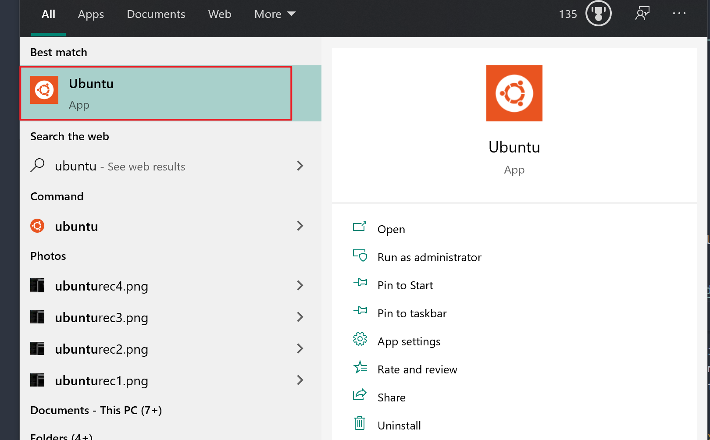
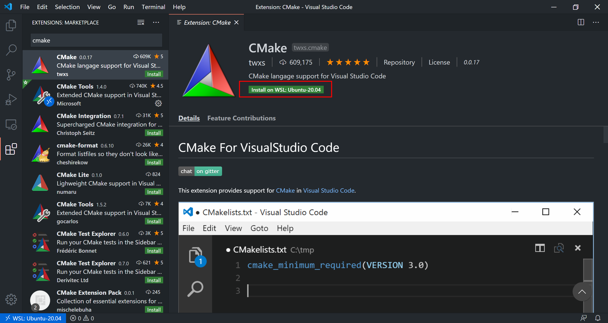
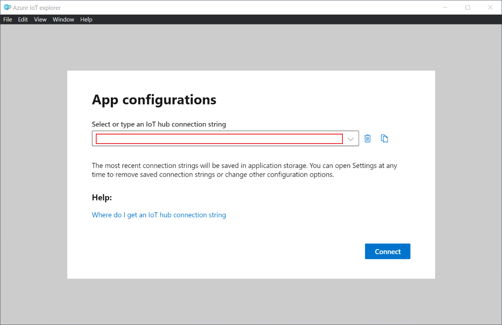
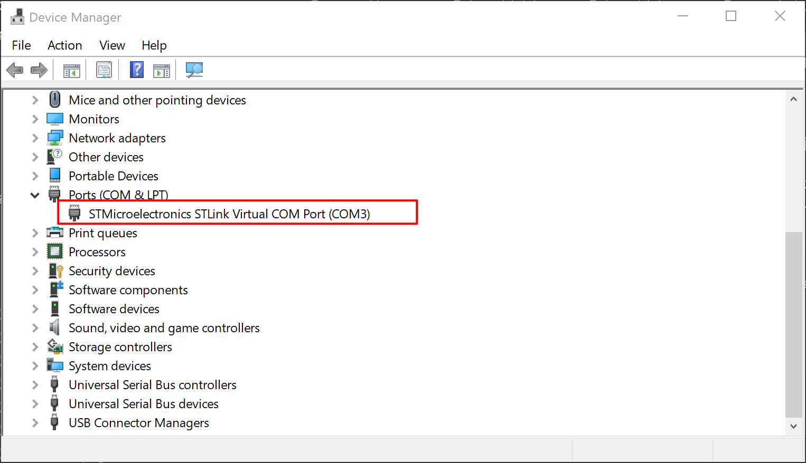
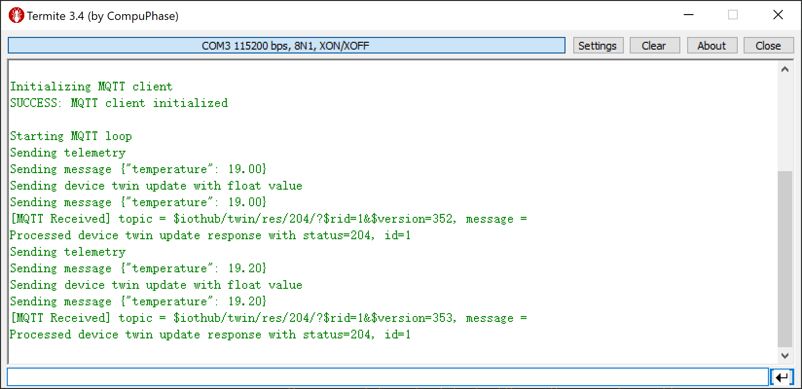
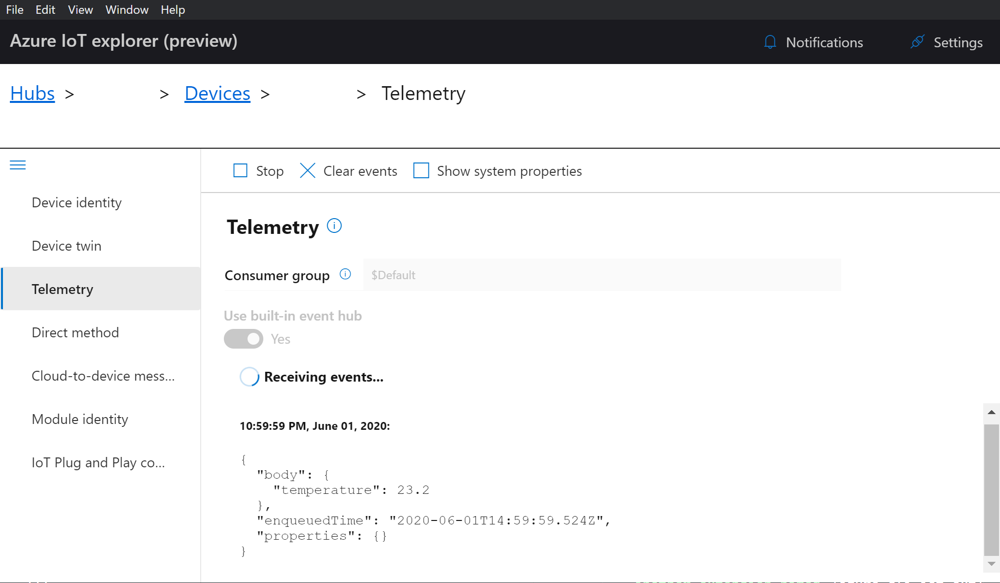
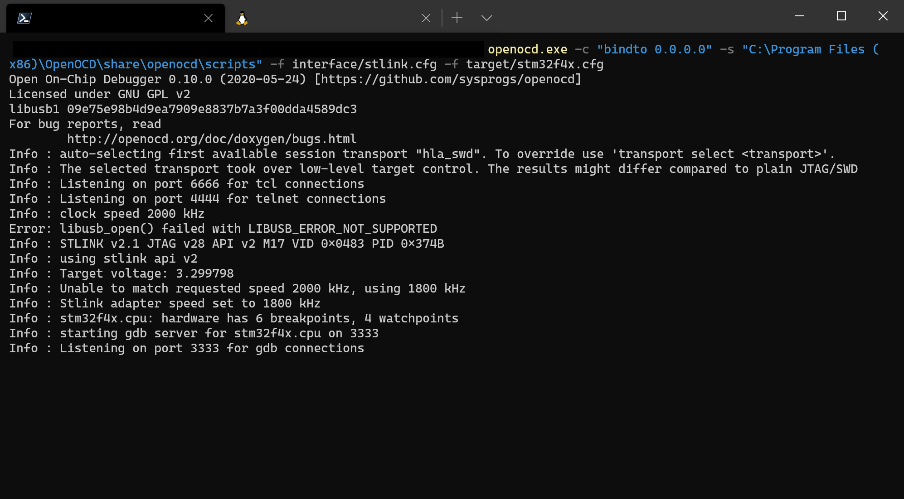
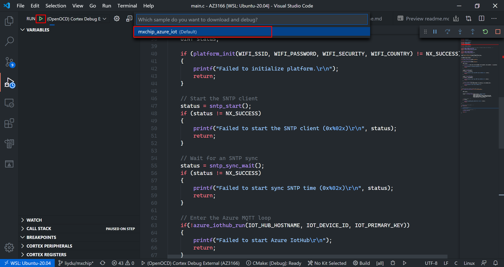
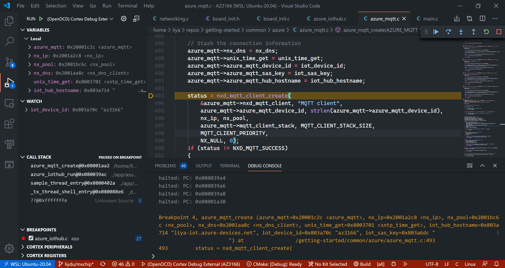

# Getting started with the MXChip AZ3166 IoT DevKit

**Total completion time**:  30 minutes

In this tutorial you use Azure RTOS to connect the MXChip AZ3166 IoT DevKit (hereafter, the IoT DevKit) to Azure IoT. The article is part of the series [Getting started with Azure RTOS](https://go.microsoft.com/fwlink/p/?linkid=2129824). The series introduces device developers to Azure RTOS, and shows how to connect several device evaluation kits to Azure IoT.

You will complete the following tasks:

* Install a set of embedded development tools for programming the IoT DevKit in C
* Build an image and flash it onto the IoT DevKit
* Create an Azure IoT hub and securely connect the IoT DevKit to it
* Use Azure CLI to view device telemetry, view properties, and invoke cloud-to-device methods

## Prerequistes

* A PC running Microsoft Windows (Windows 10 recommended)
* If you don't have an Azure subscription, [create one for free](https://azure.microsoft.com/free/?WT.mc_id=A261C142F) before you begin.
* [Git](https://git-scm.com/downloads)
* Hardware

    > * The [MXChip AZ3166 IoT DevKit](https://aka.ms/iot-devkit) (IoT DevKit)
    > * Wi-Fi 2.4 GHz
    > * USB 2.0 A male to Micro USB male cable

## Prepare the development environment

To set up your development environment, first you clone a GitHub repo that contains all the assets you need for the tutorial. Then you install a set of programming tools.

### Clone the repo for the tutorial

Clone the following repo to download all sample device code, setup scripts, and offline versions of the documentation. If you previously cloned this repo in another tutorial, you don't need to do it again.

To clone the repo, run the following command in Ubuntu bash command line:

```
git clone https://github.com/azure-rtos/getting-started
```

### Install the tools

* [Ubuntu 18.04 or above installed in WSL2](https://docs.microsoft.com/windows/wsl/wsl2-install) on Windows 10. You will set up your development environment in it.
* [Visual Studio Code](https://code.visualstudio.com/) for Windows with [Remote - WSL](https://marketplace.visualstudio.com/items?itemName=ms-vscode-remote.remote-wsl) extension installed. This is for code editing and debugging with UI supported. Learn [Develop in WSL](https://code.visualstudio.com/docs/remote/wsl) if you are new to it.
* [Termite](https://www.compuphase.com/software_termite.htm) terminal for viewing log output from COM port.


#### Prepare the toolchain in WSL2

1. In Windows 10, launch Ubuntu bash command line.

    

1. Download and untar [GCC ARM Toolchain in Linux](https://developer.arm.com/tools-and-software/open-source-software/developer-tools/gnu-toolchain/gnu-rm/downloads).

    ```bash
    cd ~

    wget -c "https://armkeil.blob.core.windows.net/developer/Files/downloads/gnu-rm/9-2019q4/gcc-arm-none-eabi-9-2019-q4-major-x86_64-linux.tar.bz2"

    untar xvjf ./gcc-arm-none-eabi-9-2019-q4-major-x86_64-linux.tar.bz2

    sudo mv ./gcc-arm-none-eabi-9-2019-q4-major /opt/.
    ```

1. Install CMake and Ninja build system.

    ```bash
    sudo apt update && apt install -y cmake ninja-build

    cmake --version
    ```
    Make sure the CMake version is above 3.14.0. If not, you can follow [this guide](https://apt.kitware.com/) to install the latest CMake.

#### Install VS Code extensions

You will install a couple VS Code extensions to enable the syntax highlighting and debugging experiences.

1. Launch Visual Studio Code, click the left bottom corner to launch Remote command palette and select **Remote-WSL: New Window**.

    

1. In Extensions tab (`Ctrl+Shift+X`), search and install the following extensions in the WSL.

    * C/C++
    * CMake
    * Cortex-Debug

    

## Prepare Azure resources

To prepare Azure cloud resources and connect a device to Azure, you can use [Azure portal](https://portal.azure.com).

### Create an IoT hub

1. Follow [this guide](https://docs.microsoft.com/azure/iot-hub/iot-hub-create-through-portal) to create an Azure IoT Hub.

1. Save the IoT Hub Connection String in **IoT Hub -> Setting -> Shared access policies -> iothubowner -> Connection string** for later use.

### Register a device

In this section, you create a new device instance and register it with the Iot hub you created. You will use the connection information for the newly registered device to securely connect your physical device in a later section.

1. Launch Azure IoT Explorer, paste the IoT Hub connection string you just
noted and select **Connect**.

    

1. Select **New** to create a new IoT device. Enter the **Device ID** and leave the rest as default then select **Create**.

    

1. Select from the list for the device you just created. In the **Device identity**
tab, copy **Device ID** and **Primary Key** for later use.

1. Also copy the **IoT Hub name** from the highlighted area.

    

1. Confirm that you have the copied the following values from to use in the next section.
    * IoT Hub Name
    * Device ID
    * Primary Key

## Prepare the device

To connect the IoT DevKit to Azure, you'll modify a configuration file for Wi-Fi and Azure IoT settings, rebuild the image, and flash the image to the device.

### Add configuration

1. In VSCode or any other text editor, edit the file `getting-started/MXChip/AZ3166/app/azure_config.h` to set the Wi-Fi constants to the following values from your local environment.

    |Constant name|Value|
    |-------------|-----|
    |`WIFI_SSID` |{*Your Wi-Fi ssid*}|
    |`WIFI_PASSWORD` |{*Your Wi-Fi password*}|
    |`WIFI_SECURITY` |{*Your Wi-Fi security type*}|
    |`WIFI_COUNTRY` |{*Your Wi-Fi is located in a country*}|

1. Edit the same file to set the Azure IoT device information constants to the values that you saved after you created Azure resources.

    |Constant name|Value|
    |-------------|-----|
    |`IOT_HUB_HOSTNAME` |{*Your Iot hub hostName value*}|
    |`IOT_DEVICE_ID` |{*Your deviceID value*}|
    |`IOT_PRIMARY_KEY` |{*Your primaryKey value*}|

    > The IoT Hub host name format is `{Your IoT Hub name}.azure-devices.net`.

### Build the image

We will build the image in Ubuntu of WSL2.

1. Open Ubuntu bash command line.

1. Build the project with the script that invokes CMake and Ninja.

    ```bash
    cd ./getting-started/MXChip/AZ3166/

    ./rebuild.sh
    ```

1. After the build completes, confirm that a binary file was created in the following path

    ```txt
    getting-started\MXChip\AZ3166\build\app\mxchip_azure_iot.bin
    ```

### Flash the image

1. Download and unzip [OpenOCD for Windows](https://gnutoolchains.com/arm-eabi/openocd/) to `C:\Program Files(x86)\OpenOCD`. Add `openocd.exe` path in Windows Path Environment Variables.

1. Install ST-Link driver within unzipped OpenOCD folder by running `OpenOCD/drivers/ST-Link/stlink_winusb_install.bat`.

1. Connect the Micro USB cable to the Micro USB port on the IoT DevKit, and then connect it to your computer.

1. In File Explorer, find the IoT DevKit device connected to your computer. It is a driver labeled as **AZ3166**.

1. Copy the image file *mxchip_azure_iot.bin* that you created in the previous section, and paste it into the root folder of the IoT DevKit. The flashing process starts automatically.

    > Note: During the flashing process, the RED LED toggled on IoT DevKit. The process completes in a few seconds without further notification.

### Confirm device connection details

You can use the **Termite** utility to monitor communication and confirm that your device is set up correctly.
> Note: If you have issues getting your device to initialize or connect after flashing, see [Troubleshooting](../../docs/troubleshooting.md).

1. Open Device Manager and find the COM port for the MXChip IoT DevKit.

    

1. Start Termite and configure the COM port and settings as:

    * Baud rate: 115,200
    * Data bits: 8
    * Stop bits: 1

    Now you can view the DevKit is publising temperature telemetry to IoT Hub in every a few seconds.

    

## View telemetry

You can use Azure IoT Explorer to inspect the flow of telemetry from the device to Azure IoT.

1. In Azure IoT Explorer, select the device you just created from the list. Select **Telemetry** tab and select **Start** to to monitor telemetry from your device.

    

## View device properties

Using Azure IoT Explorer, you can inspect the properties on connected device.

1. In Azure IoT Explorer, select the device you just created from the list. Select **Device Twin** tab and select **Refresh** to to view the properties from your device.

    

## Call a direct method on the device

*TBD*

## Debugging

You can debug the firmware application in VS Code using [OpenOCD](http://openocd.org/) and [GDB](https://www.gnu.org/software/gdb/).

1. In Windows command line or PowerShell, launch **openocd** server:

    ```cmd
    openocd -c "bindto 0.0.0.0" -s "C:\Program Files(x86)\OpenOCD\share\openocd\scripts" -f interface/stlink.cfg -f target/stm32f4x.cfg
    ```

    

1. Launch VS Code, click the left bottom corner to launch Remote command palette and select **Remote-WSL: New Window** to open the remote connection to WSL2.

1. Select **View > Terminal** to open the terminal of Ubuntu bash command line within VS Code. Then get  Windows host IP address in WSL2:

    ```bash
    cat /etc/resolv.conf
    ```

    Copy the IP adress of nameserver like the sample output:

    ```txt
    # [network]
    # generateResolvConf = false
    nameserver 172.17.176.1
    ```

1. Replace the IP address in `./getting-started/MXChip/AZ3166/.vscode/launch.json`.

    ```json
    // Get WSL2 IP from "cat /etc/resolv.conf"
    "gdbTarget": "{Your Windows host IP}:3333",
    ```

1. In VSCode, press `F5` or launch debug Run tab. Then select `mxchip_azure_iot`.

    

1. It will first flash the firmware onto the DevKit and start running it and stopped at `main()`. Press `F5` again or select continue to run the app.

View [Debug C++ in Visual Studio Code](https://code.visualstudio.com/docs/cpp/cpp-debug) to learn debugging in VS Code.



## Clean up resources

If you no longer need the Azure resources created in this tutorial, you can use the Azure portal to delete them.

If you continue to another tutorial in this getting started guide, you can keep the resources you've already created and reuse them.

> **Important**: Deleting a resource group is irreversible. The resource group and all the resources contained in it are permanently deleted. Make sure that you do not accidentally delete the wrong resource group or resources.